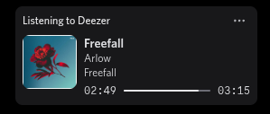
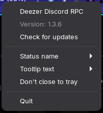
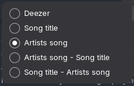
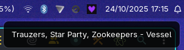
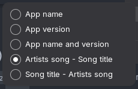

<div align="center">
    <h1>Deezer Discord RPC</h1>
    <a href="https://github.com/CuteTenshii/deezer-discord-rpc/issues"></a>
    <a href="https://github.com/CuteTenshii/deezer-discord-rpc/releases/latest"></a>
    <a href="https://github.com/CuteTenshii/deezer-discord-rpc/releases/latest"></a>
    <a href="https://github.com/CuteTenshii/deezer-discord-rpc/commits"></a>
    <hr />
    <p>A Discord RPC for showing the music you're listening to on Deezer (like the Spotify integration).</p>
    <a href="https://github.com/CuteTenshii/deezer-discord-rpc/wiki/RPC-doesn't-show%3F">RPC doesn't show?</a>
</div>

## Features

* Updates instantly
* Shows the song title, the song artist(s), the album name and cover, and the song duration
* Add links to the song, the artist and the album, on the RPC
* Shows a "Listen on Deezer" button that opens the song on Deezer, if supported. **You cannot see this button on your own profile due to Discord restrictions.**
* Includes an in-app updater
* Hides the activity if no song is playing
* Includes an ad-blocker, so it can block Deezer ads, Google Analytics, Sentry requests...
* Supports songs, radios, personal songs (MP3s), podcasts

<table>
<tr>
<td align="center"><br /><i>RPC on profile</i></td>
</tr>
<tr>
<td align="center"><br /><i>Tray menu. See below for options explanations</i></td>
</tr>
</table>

## Installation

### Arch Linux (AUR)

You can install the [`deezer-discord-rpc-bin`](https://aur.archlinux.org/packages/deezer-discord-rpc-bin) package from the AUR using your favorite AUR helper, such as `yay` or `paru`:

```bash
yay -S deezer-discord-rpc-bin
```

### Homebrew (macOS)

You can install the app using Homebrew on macOS:

```bash
brew install --cask cutetenshii/stuff/deezer-discord-rpc
```

### Pre-built Binaries

| **Platform**                     | **Download**                                                                                                                                                                                                                                                         |
|----------------------------------|----------------------------------------------------------------------------------------------------------------------------------------------------------------------------------------------------------------------------------------------------------------------|
| **Windows**                      | [](https://github.com/CuteTenshii/deezer-discord-rpc/releases/latest/download/DeezerDiscordRPC-win-x64.exe)                       |
| **Debian/Ubuntu**                | [](https://github.com/CuteTenshii/deezer-discord-rpc/releases/latest/download/DeezerDiscordRPC-linux-amd64.deb)   |
| **Fedora**                       | [](https://github.com/CuteTenshii/deezer-discord-rpc/releases/latest/download/DeezerDiscordRPC-linux-x86_64.rpm) |
| `.snap`                          | [](https://github.com/CuteTenshii/deezer-discord-rpc/releases/latest/download/DeezerDiscordRPC-linux-amd64.snap)             |
| `.AppImage`                      | [](https://github.com/CuteTenshii/deezer-discord-rpc/releases/latest/download/DeezerDiscordRPC-linux-x86_64.AppImage)   |
| **macOS** (arm64, Apple Silicon) | [](https://github.com/CuteTenshii/deezer-discord-rpc/releases/latest/download/DeezerDiscordRPC-mac-arm64.dmg)        |
| **macOS** (x64, Intel)           | [](https://github.com/CuteTenshii/deezer-discord-rpc/releases/latest/download/DeezerDiscordRPC-mac-x64.dmg)            |

## Building from Source

1. Clone the repository: `git clone https://github.com/CuteTenshii/deezer-discord-rpc`
2. Install the dependencies with bun (package manager): `bun install`
3. To build the app for release, run: `bun run build`
4. If you want to run it in development mode, run: `bun run start`

## Tray Menu Options

- **Status name:** The status that will show on Discord. For comparison, Spotify integration uses the artists.<br />
  <br />
  
- **Tooltip text:** The text that will show when you hover the Deezer tray icon.<br />
  <br />
  
- **Don't close to tray:** when closing the app, should it be completely closed (enabled) or kept running in the background? (default, disabled)

## Star History

[](https://star-history.com/#CuteTenshii/deezer-discord-rpc&Date)

## Contributors

[](https://github.com/CuteTenshii/deezer-discord-rpc/graphs/contributors)

## License

This project is licensed under the MIT License - see the [LICENSE](LICENSE) file for details.
